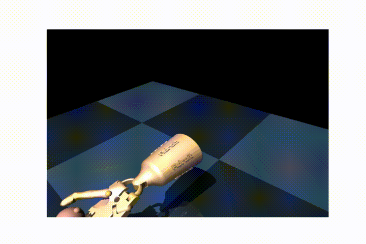
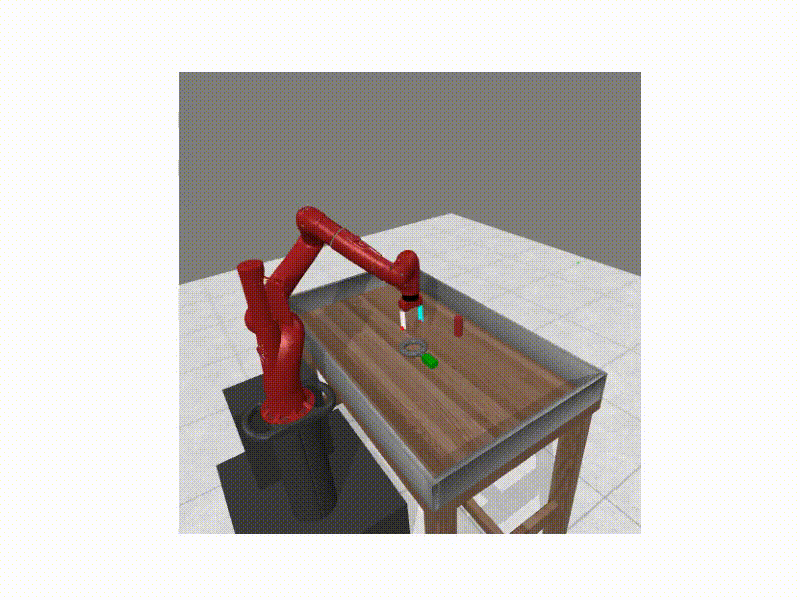
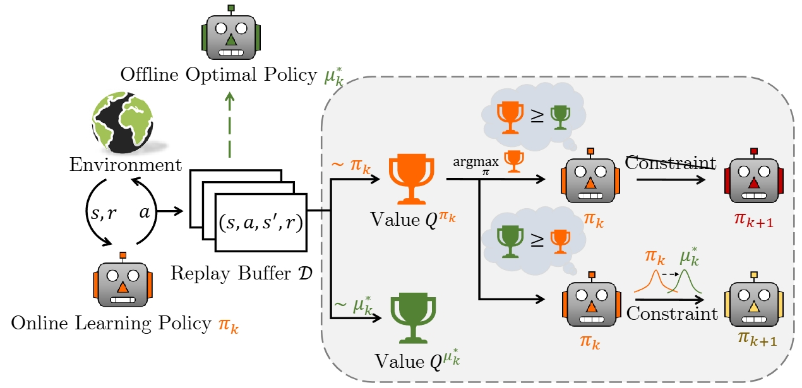
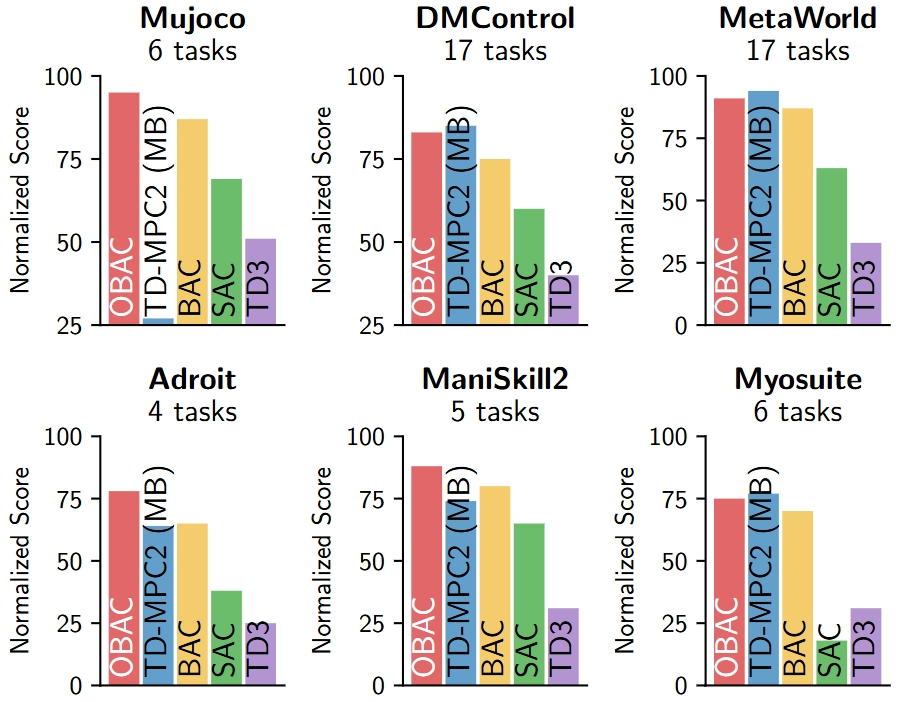
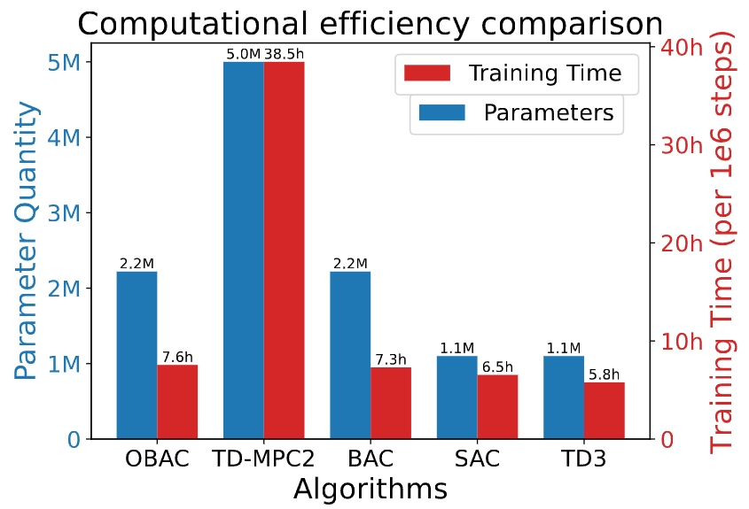

<h1>OBAC</span></h1>

Official implementation of

[Offline-Boosted Actor-Critic: Adaptively Blending Optimal Historical Behaviors in Deep Off-Policy RL](https://roythuly.github.io/OBAC_web/) by

Yu Luo, Tianying Ji, Fuchun Sun*,  Jianwei Zhang, Huazhe Xu, Xianyuan Zhan



----

## Overview

Offline-Boosted Actor-Critic (OBAC), a model-free online RL framework that elegantly identifies the outperforming offline policy through value comparison, and uses it as an adaptive constraint to guarantee stronger policy learning performance. 



We evaluate our method across **53** diverse continuous control tasks spanning \textbf{6} domains: **Mujoco**, **DMControl**, **Meta-World**, **Adroit**, **Myosuite**, and **Maniskill2**, comparing it with [BAC](https://arxiv.org/abs/2306.02865), [TD-MPC2](https://arxiv.org/abs/2310.16828), [SAC](https://arxiv.org/abs/1801.01290), and [TD3](https://arxiv.org/abs/1801.01290).

 

----

## Getting started

We provide examples on how to train and evaluate OBAC agent.

### Training

See below examples on how to train OBAC on a single task.

```python
python main.py --env_name YOUR_TASK
```

We recommend using default hyperparameters. See `utilis/default_config.py` for a full list of arguments.

### Evaluation

See below examples on how to evaluate OBAC checkpoints.

```python
python evaluate.py YOUR_TASK_PATH/../checkpoint best
```

----

## Citation

If you find our work useful, please consider citing our paper as follows:

```
@inproceedings{Luo2024obac,
  title={Offline-Boosted Actor-Critic: Adaptively Blending Optimal Historical Behaviors in Deep Off-Policy RL}, 
  author={Yu Luo and Tianjing Ji and Fuchun Sun and Jianwei Zhang and Huazhe Xu and Xianyuan Zhan},
  booktitle={International Conference on Machine Learning},
  year={2024}
}
```
----

## Contributing

Please feel free to participate in our project by opening issues or sending pull requests for any enhancements or bug reports you might have. We’re striving to develop a codebase that’s easily expandable to different settings and tasks, and your feedback on how it’s working is greatly appreciated!

----

## License

This project is licensed under the MIT License - see the `LICENSE` file for details. Note that the repository relies on third-party code, which is subject to their respective licenses.
